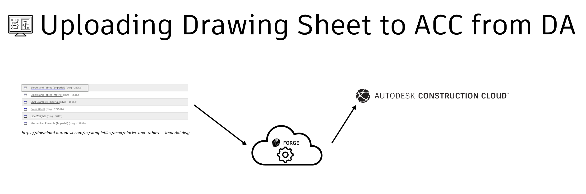

# Uploading File to BIM360/ACC from Design Automation Through CLI

[](https://forge.autodesk.com/en/docs/design-automation/v3)
[](https://forge.autodesk.com/en/docs/acc/v1/overview/)


[](http://opensource.org/licenses/MIT)


# Overview

This sample show how to upload end result to desired folder in ACC project, if we know the Project and Folder Id, we can use two-legged authentication to create storage and version the upload file.

This sample demonstrates the use of WebSocket API and digital signing the activity




## Demo


# Setup

## Prerequisites

1. **Forge Account**: Learn how to create a Forge Account, activate subscription and create an app at [this tutorial](http://learnforge.autodesk.io/#/account/).

2. **Visual Studio**: Either Community (Windows) or Code (Windows, MacOS).

3. **.NET 5** basic knowledge with C#

4. Fetch `ProjectId` and `FolderId` from ACC  URL respectively.

   Example uses PowerShell

   ```powershell
   Add-Type -AssemblyName System.Web
   $url ="https://acc.autodesk.com/build/files/projects/adeb4f3b-1ee0-4fca-bb80-30934ae15668?folderUrn=urn%3Aadsk.wipprod%3Afs.folder%3Aco.SbeD5ppRRQ-SiqRIbSPA0g&viewModel=detail&moduleId=folders"
   $url.Split("/?=&")[6,8]
   ```

   ```bash
   adeb4f3b-1ee0-4fca-bb80-30934ae15668
   urn:adsk.wipprod:fs.folder:co.SbeD5ppRRQ-SiqRIbSPA0g
   ```

NOTE: add prefix `b.` to ProjectId.

## Running locally

Clone this project or download it. It's recommended to install [GitHub desktop](https://desktop.github.com/). To clone it via command line, use the following (**Terminal** on MacOSX/Linux, **Git Shell** on Windows):

```
git clone https://github.com/MadhukarMoogala/UploadUtilFor-ACC.git
cd UploadUtilFor-ACC
set FORGE_CLIENT_ID=
set FORGE_CLIENT_SECRET=
dotnet restore
dotnet run
```

**Visual Studio** (Windows):

Right-click on the project, then go to **Add New Item\Web\JSON File**. Adjust the settings as shown below. Set Forge variables, define the following:

```json
{
  "Forge": {
    "ClientId": "",
    "ClientSecret": ""
  }
}

```

Alternatively, right-click on the project, then go to **Debug**. Adjust the settings as shown below. For environment variable, define the following:

- FORGE_CLIENT_ID: `your id here`
- FORGE_CLIENT_SECRET: `your secret here`

**Visual Studio Code** (Windows, MacOS):

Open the folder, at the bottom-right, select **Yes** and **Restore**. This restores the packages (e.g. Autodesk.Forge) and creates the launch.json file. See *Tips & Tricks* for .NET Core on MacOS.

## Build 

```bash
Microsoft (R) Build Engine version 16.10.1+2fd48ab73 for .NET
Copyright (C) Microsoft Corporation. All rights reserved.

  Determining projects to restore...
  All projects are up-to-date for restore.
  UploadUtil -> D:\Work\Forge\UploadFileToBIM360\UploadUtil\bin\x64\Debug\net5.0\UploadUtil.dll

Build succeeded.
    0 Warning(s)
    0 Error(s)

Time Elapsed 00:00:02.56
```


# Further Reading

Documentation:

- [BIM 360 API](https://developer.autodesk.com/en/docs/bim360/v1/overview/) and [App Provisioning](https://forge.autodesk.com/blog/bim-360-docs-provisioning-forge-apps)

- [Data Management API](https://developer.autodesk.com/en/docs/data/v2/overview/)

- [DA-3-LeggedToken](https://forge.autodesk.com/en/docs/design-automation/v3/developers_guide/3-legged-oauth-token-usage/)

- [DA-WebSocket API](https://forge.autodesk.com/en/docs/design-automation/v3/developers_guide/websocket-api/)

  

### Tips & Tricks

This sample uses .NET 5 and works fine on both Windows and MacOS, see [this tutorial for MacOS](https://github.com/augustogoncalves/dotnetcoreheroku).

### Troubleshooting

1. **Cannot see my BIM 360 projects**: Make sure to provision the Forge App Client ID within the BIM 360 Account, [learn more here](https://forge.autodesk.com/blog/bim-360-docs-provisioning-forge-apps). This requires the Account Admin permission.
2. **error setting certificate verify locations** error: may happen on Windows, use the following: `git config --global http.sslverify "false"`

## License

This sample is licensed under the terms of the [MIT License](http://opensource.org/licenses/MIT). Please see the [LICENSE](https://github.com/MadhukarMoogala/UploadUtilFor-ACC/blob/master/LICENSE) file for full details.

## Written by

Madhukar Moogala [@galakar](http://twitter.com/galakar), [Forge Partner Development](http://forge.autodesk.com/)

